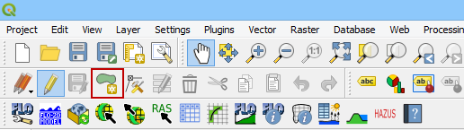

Create a Grid
=============

Method 1 From an External Layer
-------------------------------

1. In order to create a grid, a domain layer must be available.  If a domain layer is not available use this tutorial:
   :ref:`Build a Computational Domain`

2. Click the Create Grid Button

2. Select external polygon layer.

3. This method will copy the polygon to the Comp Domain Layer and create
   the grid.

4. The second method is to create a polygon in the *Computational
   Domain* layer in the *Layers Panel*>\ *User Layers*.

.. image:: img/creategrid2.png
   :width: 2.51042in
   :height: 3.9485in

5. Select the *Toggle Editing* icon from the QGIS Toolbar to activate
   the editor and then click the *Add Feature* button to create a
   polygon.

6. Digitize the polygon in the map canvas and right click to close the
   polygon. Set the grid element size and click *OK* to complete the
   polygon.

|image1|\ |image2|

7. Save the layer and turn off the editor by clicking the Editor tool to
   toggle it off.

.. image:: img/creategrid6.png
   :width: 4.35181in
   :height: 1.4in

8. From the Grid Tools widget, select Create Grid.

.. image:: img/creategrid7.png
   :width: 3.15043in
   :height: 1.24984in

9. If this is a new project, the grid system will be created
   automatically. If this is a current project, the user will be asked
   to overwrite the current grid system. Click *Yes* to continue and
   *No* to cancel. Once the grid system is generated, the “Grid
   created!” message will appear. Click *OK* to close.

.. image:: img/creategrid8.png
   :width: 5.36458in
   :height: 1.18861in

10. If the grid system is not as expected, edit the *Computational
    Domain* layer and repeat the *Create Grid* process. Each time the
    grid system is replaced, the elevation and roughness data are also
    reset and must be recalculated. Each time the grid system is
    replaced, it may be necessary to re-assign the *User Layers* to the
    *Schematic Layers*. The grid system data is saved to the *Grid*
    *Schematic Layer* as shown below.

