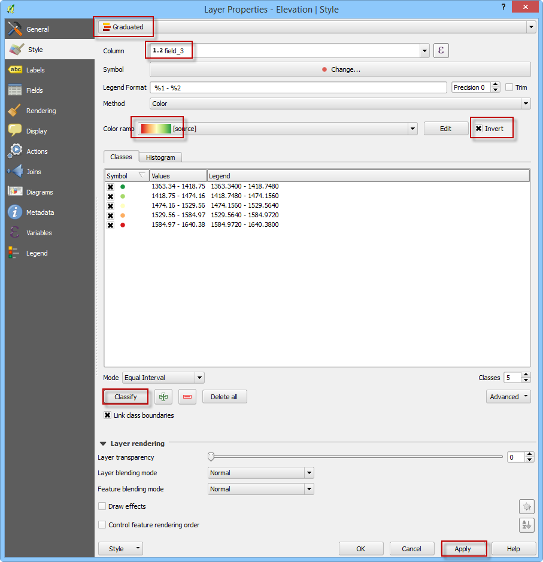
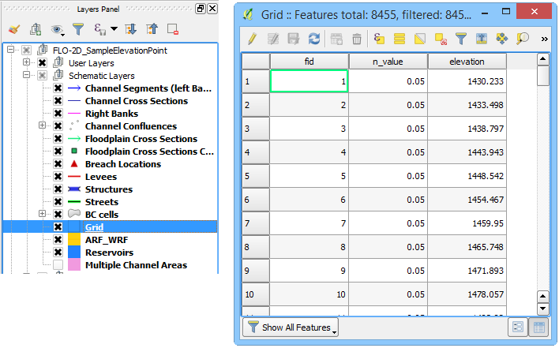

Sample Elevation Data from Points and LiDAR
===========================================

1. Adjust the Style properties of the elevation data to assist the
   quality control measures for reviewing the data. For example,
   elevation data that has a large range can wash out the detail in
   local areas of the project area.

2. Double click the polygon layer to open the *Properties* window and
   select the style tab to perform the following.

3. Assign graduated colors;

4. Select field to represent colors;

5. Select color ramp;

6. Classify the data (classifying the data adjustments will assist in
   locating erroneous data).

7. The point data style is a graduated color scheme set to the elevation
   scale (see figure below).

.. image:: img/sampleelefrompoints2.png

Sample Data
-----------

8. Click the *Assign Elevation to Grid from Points Layer* icon to
   interpolate the elevation data to the grid.

.. image:: img/sampleelefrompoints3.png

9.  The sampling dialog box appears to select the point source,
    elevation field, and calculation type. Choose a max search distance
    to extend the search for empty grid elements. The distance is in the
    native map units. This field can be assigned a zero value to default
    to the minimum search distance.

    .. image:: img/sampleelefrompoints4.png

10. Once the calculation is complete, the following dialog is displayed.
    Click *OK* to continue.

.. image:: img/sampleelefrompoints5.png

11. The elevation data is saved to the *Grid* Layer in the *Schematic
    Layers* group.

